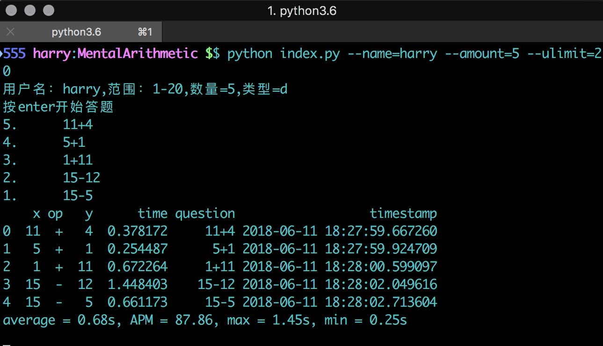
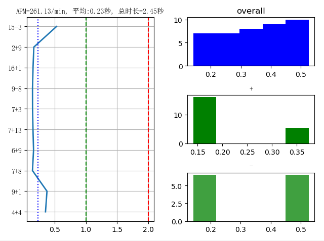
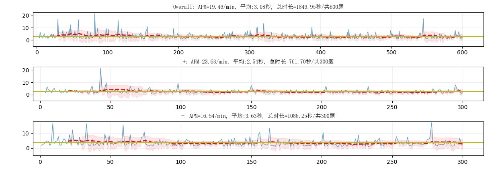

# MentalArithmetic 小学口算训练统计工具

平时纸质口算使用答题卷, 存在以下问题
* 题目固定.反复练习后, 小孩直接背诵答案顺序, 并未真正训练口算
* 不同小朋友可能会有不同的难题，同一份试卷无法覆盖每个个体
* 题目数量有限, 没有全覆盖所有可能的题型
* 无法统计单题使用时间, 对答题情况进行精确分析
* 无法根据小孩答题情况, 动态调整出题难度

针对纸质试卷问题, MentalArithmetic工具提供
* 随机出题, 每次测试题目组合不重复
* 单题用时记录
* 答题完毕后实时生成统计分析结果
* 可以对历史答题数据记录分析
* 根据历史答题时间, 动态调整出题频率. 针对性训练不熟练的题
* 能力分析. 根据测试题记录, 给出口算速度提高的分析报告, 便于平时进行针对性训练.(未实现)

出题方式（说明以20以内加减法为例，其他口算出题原理类似，暂时不做细节介绍）
* 随机出题模式
20以内加减法共20*2*20=800组合. 考虑到一些不需要练习的情况, 出题去除了以下组合
	* 相减<=0 (a<=b)
	* 相加>20的题目 (a+b>20)
	* 含10和1的题
剩余题库=380题. 

* 动态出题模式
当完成的随机出题数量超过300题后(答题8次后), 会自动触发动态出题(可以开始时输入's'保留随机出题模式).
动态出题时会统计最近300题用时,然后在用时最长的100题中随机抽取80%题目. 为了巩固记忆及避免成就感不足，会保留20%为随机题。

# 环境

操作系统: 支持windows, macOS
运行环境: python 3.5+

## 环境搭建
* 安装git, 你能上github，默认你会装git啦。
* 安装python3.5+, https://www.python.org/downloads/
* 安装pip: https://pypi.python.org/pypi/pip#downloads , 
	* 在下载目录执行命令安装
	`python setup.py install`
* 下载MentalArithmetic源代码
	* git clone https://github.com/harry0519/MentalArithmetic.git 

* 安装第三方依赖库: 
`pip install -r requirements.txt`

环境配置对于非程序员可能比较困难,如果碰到问题可以在issue留言. 我也尝试了直接出exe包,但是考虑多系统的复杂性,没有计划做二进制发布.等功能晚上后,考虑会移植到微信小程序.

# 运行

默认启动命令, 试题数量为40题，100以内加减法, 用户名为Eason。

`python index.py`

可以通过命令行参数配置. 修改为20以内，单次训练50题，用户名为 Harry

`python index.py --name=harry --amount=50 --ulimit=20`

按enter后开始答题.
答出后马上按enter表示完成，会连续出题直到结束
答题完毕会显示本次答题的时间变化信息及整体, 加法,减法的统计分类信息.

答题信息保存在两个文件中
* 答题详细信息：answers_用户名_范围.csv
* 答题统计信息：history_用户名_范围.csv

答题完成后统计图表

* 左侧图表为本次答题所有题目详细时间.蓝色线段为本次答题单题时长变化线. 蓝线为本次答题平均时间, 红线为2秒(1分钟30题), 绿线为1秒(1分钟60题).
* 右侧上部蓝色为整体速度分布.x坐标:时间, y坐标:题目落在区间内的题目数量.
* 右侧中部/下部绿色柱状图分别为加法和减法的histgram 图
* 下方图表中, 蓝色线段为本次答题单题时长变化线. 红色参考线为2秒(1分钟30题), 绿色参考线为1秒(1分钟60题). 

# 历史数据分析
答题完成后, 所有历史答题记录会保存在anwser.csv文件中, 统计信息保存在history.csv文件中.
分析命令, 其中--filename=history_用户名_范围.csv

`python analytics.py --filename=history_eason_100.csv`

可以创建历史数据分布图.其中趋势线为答题时间变化趋势和20题的平均线.阴影部分为过去20题的标准差区间.如果题目用时超出标准差区间上边界,可以认为需要强化训练; 如果低于下边界,可以认为暂时不需要训练.

